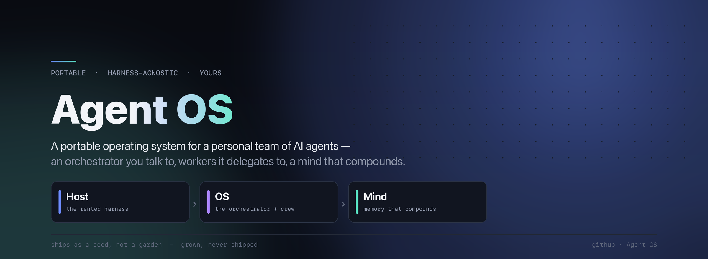

<p align="center">
  
</p>

# Agent OS

A portable, harness-agnostic operating system for a personal team of AI agents — an
**orchestrator** you talk to, **workers** it delegates to, and a **watcher** that proposes how the
whole thing should grow. It sits on a two-axis **memory** that compounds over time, and it travels
with you across models and hosts.

> **Agent OS ships as a _seed_, not a _garden_.** What you install is a nameless engine plus the
> machinery to specialize it. What you end up with — a named orchestrator, a constitution in your
> own words, a team shaped to your life — is *grown*, never shipped. This repo is the seed.

---

## The three planes

| Plane | What it is | Owned by |
|---|---|---|
| **Host** | the harness you rent (Claude Code today) — a `CLAUDE.md` bootloader, hooks, skills, settings | rented, swappable |
| **OS** | the orchestrator, workers, watcher, and the constitution they answer to | **you**, portable |
| **Mind** | the private memory that accrues underneath — `.mem` (episodic + semantic) and `.proc` (standards), plus a rebuildable index | private, `$AGENT_OS_HOME` |

The host boots the OS; the OS reads and writes the mind; the host's hooks capture into the mind
behind the scenes. Swap the host and the OS and mind come with you.

## Memory, in two axes

Memory is organized by **cognitive type** first, topic second:

- **`episodic`** — time-bound experience (sessions, captures) → `.mem`
- **`semantic`** — durable facts & identity (decisions, knowledge, the user model) → `.mem`
- **`procedural`** — craft (principles → patterns → modules → scaffolds) → `.proc`

Both stores nest under one portable home (`$AGENT_OS_HOME`, default `~/.agentos`) and share one
local, rebuildable vector index. The Markdown stays the source of truth; the index is just a cache.

## The lifecycle

1. **Install** — drop the seed into a harness (bootloader + hooks + skills + skeletons).
2. **Genesis** — the nameless seed boots and runs a short first-run interview that names the
   orchestrator, forks the constitution into your words, and writes your first memories. The generic
   engine is now *your* instance.
3. **Daily loop** — recall → work → capture. The orchestrator delegates; the mind grows every session.
4. **Evolution loop** — the Watcher observes from outside the loop and proposes, gated, how your team
   and standards should grow. It never mutates the system silently.

## Layout

```
agentos/
├── agents/        # the team — RISEN AGENT.md per agent (seed ships only the orchestrator; the team is grown)
│   ├── orchestrator/   # the one you talk to — nameless, named at genesis
│   ├── watcher/        # the evolution observer
│   └── _template/      # scaffold for a new agent — the team grows from here
├── shared/        # CONSTITUTION.md — the law all agents answer to (a frame, filled at genesis)
├── skills/        # shared, cross-agent skills
├── memory/        # the .mem skeleton → instantiates to ~/.agentos/.mem  (private)
├── procedural/    # the .proc skeleton → instantiates to ~/.agentos/.proc (publishable)
└── harness/       # host adapters — the only part that changes per harness
    ├── claude-code/    # hooks, skills, index, INSTALL.md
    └── _template/      # scaffold for a new host adapter
```

## Status

An early, honest seed — built in the open, no overclaiming.

**✅ Built — the core stores & loop:** the portable `.mem`/`.proc` stores + a local, rebuildable index;
recall/capture hooks; the bootloader pattern; the gated gestures (`wrap-session`, `consolidate-memory`,
`promote-standard`).

**✅ Built — the seed/instance split:**

- a **nameless orchestrator** (named at genesis) and the `CONSTITUTION.md` **frame** (forked at genesis);
- **identity-as-memory** — name, voice, and forked values live in the vault and are read live, never
  baked into shipped files;
- **genesis** — the first-run interview that turns the seed into your instance
  ([`harness/claude-code/GENESIS.md`](harness/claude-code/GENESIS.md) + the `genesis` skill);
- the **Watcher** — its definition + loop ([`agents/watcher/`](agents/watcher/)) and the gated
  `watch` / `watch-review` gestures;
- a **path-rewriting installer** — [`install.sh`](harness/claude-code/install.sh): one command,
  idempotent, vault-safe, with a safe `settings.json` merge.

Each is proven at the mechanism level (sandbox / clean-machine harnesses).

**🔵 Remaining:** the full **isolated-home install-and-test** of the finished seed end-to-end (the live
genesis run); completing the **zeroing pass** (a few personal references still linger in the skeletons);
and reconciling the research explainers to this shipped seed.

## Install

See [`harness/claude-code/INSTALL.md`](harness/claude-code/INSTALL.md).
